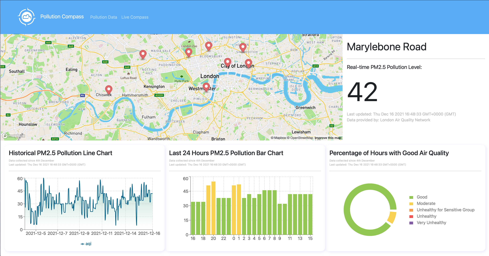

# Pollution Compass
Pollution Compass is an IoT ecosystem that actively monitors city-wide pollution level and tracks individual’s exposure to air pollution at the same time. The data displayed on the webpage comes from two separate data sources:
1. Air pollution data from monitoring sites (available at London Air Quality Network)
> Data is collected in the background on an hourly basis using a cron job scheduler.
2. PM2.5 data from IoT sensor
> Data is collected when the device is connected to a power supply using a MQTT message broker.

Fully working webapp at: [Pollution Compass](https://pollutioncompass.herokuapp.com)

